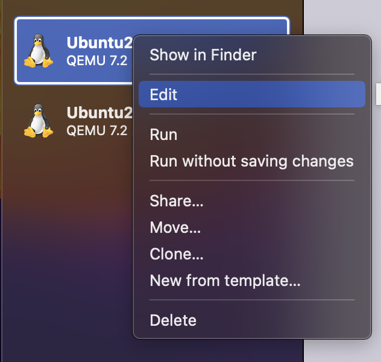
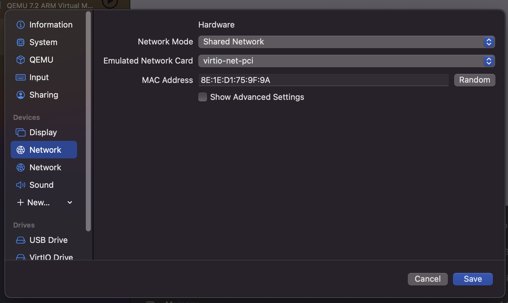
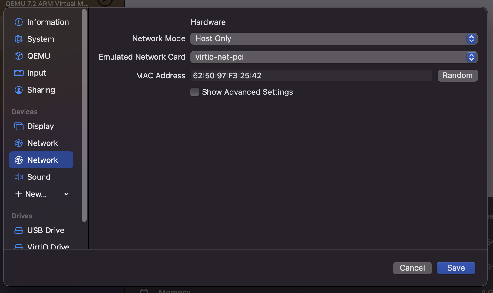
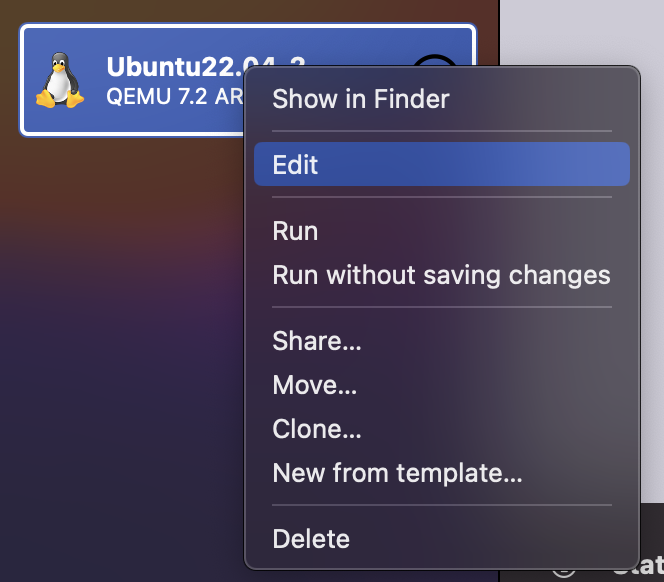
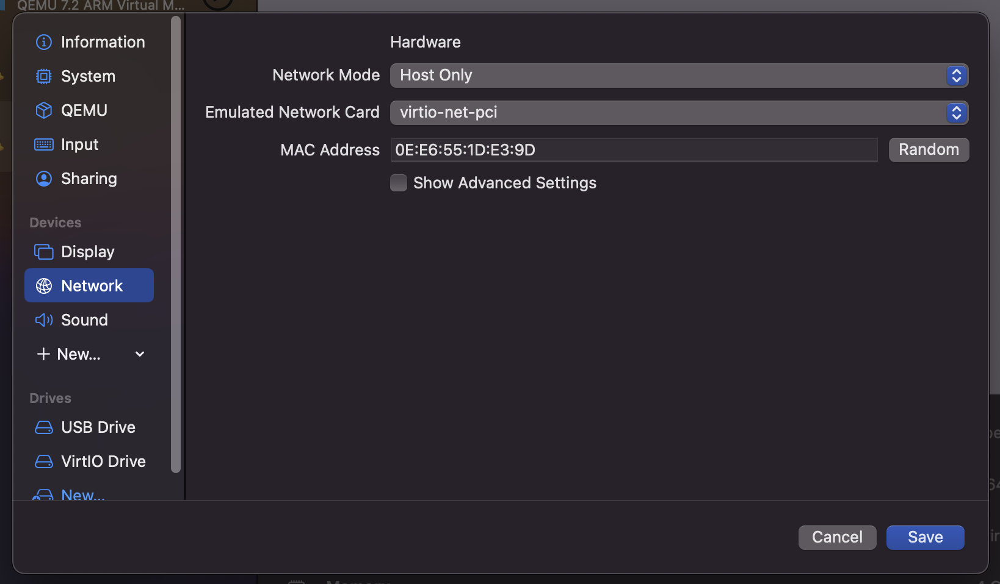

# Автоматизация развертывания и эксплуатации программного обеспечения - DevOps

[Я в Телеграм](https://t.me/amunra2) 


# Лабораторная работа №1

## Условие

[Условие лабораторной работы (выполнялось простое задание)](./task.pdf)

## Выполнение

### 1. Установить необходимое ПО

[Установка ПО для курса “DevOps”](./INSTALL.md)

### 2. Установить apache на ВМ2

```bash
sudo apt install apache2
```

### 3. Установить nginx на ВМ1

```bash
sudo apt install nginx
```

### 4. Настроить сетевые интерфейсы на ВМ1

1. Чтобы добавить второй сетевой интерфейс нужно нажать на “New…”







1. Добавить dhcp, чтобы выдался ip (после перезапустить ВМ)

```bash
sudo nano /etc/netplan/00-installer-config.yaml
`
network:
  ethernets:
    enp0s1:
      dhcp4: true
    enp0s2:
      dhcp4: true
  version: 2
`
```

### 5. Настроить сетевой интерфейс на ВМ2





### 6. Конфигурация nginx на ВМ1

```bash
sudo nano /etc/nginx/nginx.conf
`
worker processes 1;
events {
  worker_connections 1024:
}

http {
  server {
    listen 80;

    location / {
      proxy_pass http://192.168.128.2:80; # внутренний ip ВМ2
    }
  }
}
`
sudo systemctl restart nginx
```

### 7. Настроить доступ к ВМ1 через iptables

Нужно для того, чтобы не было доступа к ВМ1 из хостовой машины

```bash
# Все запрещаем
sudo iptables -I INPUT -i enp0s2 -j DROP
# Разрешаем доступ с внутреннего ip ВМ2
sudo iptables -I INPUT -i enp0s2 -s <ip> -j ACCEPT
# Список правил
sudo iptables -L -v
```

### 8. Настроить доступ к ВМ2 через iptables

Нужно для того, чтобы не было доступа к ВМ2 из хостовой машины

```bash
# Все запрещаем
sudo iptables -I INPUT -j DROP
# Разрешаем доступ с внутреннего ip ВМ1
sudo iptables -I INPUT -s <ip> -j ACCEPT
# Список правил
sudo iptables -L -v
```

### 9. Результат

По внешнему ip ВМ1 с хостовой машины должен быть доступен apache2 с ВМ2

_@amunra2 (2023г.)_
