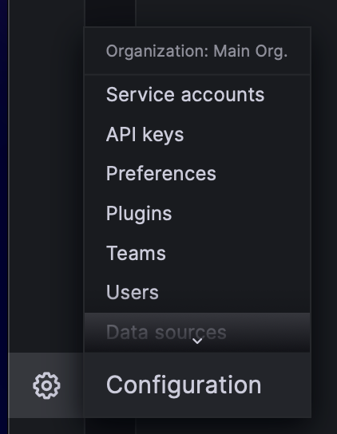
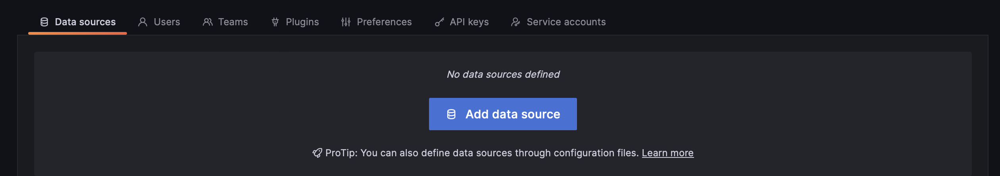
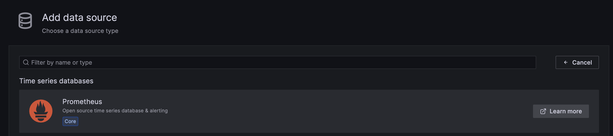
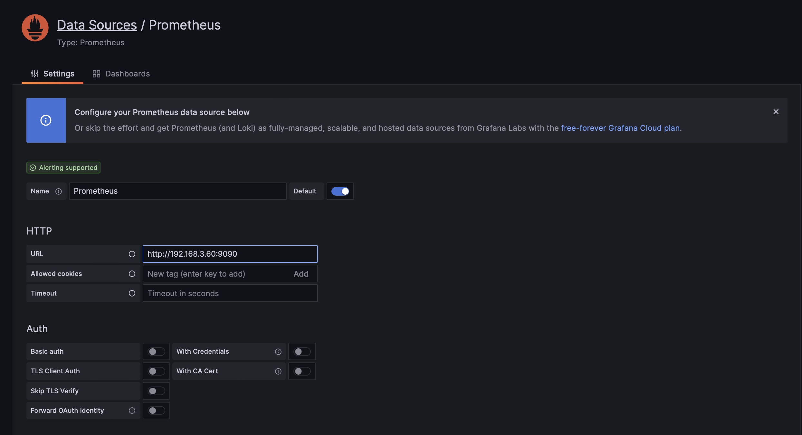
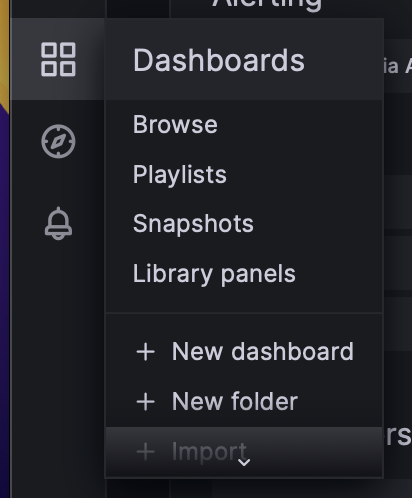
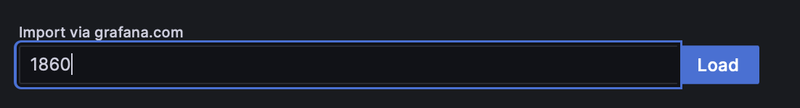
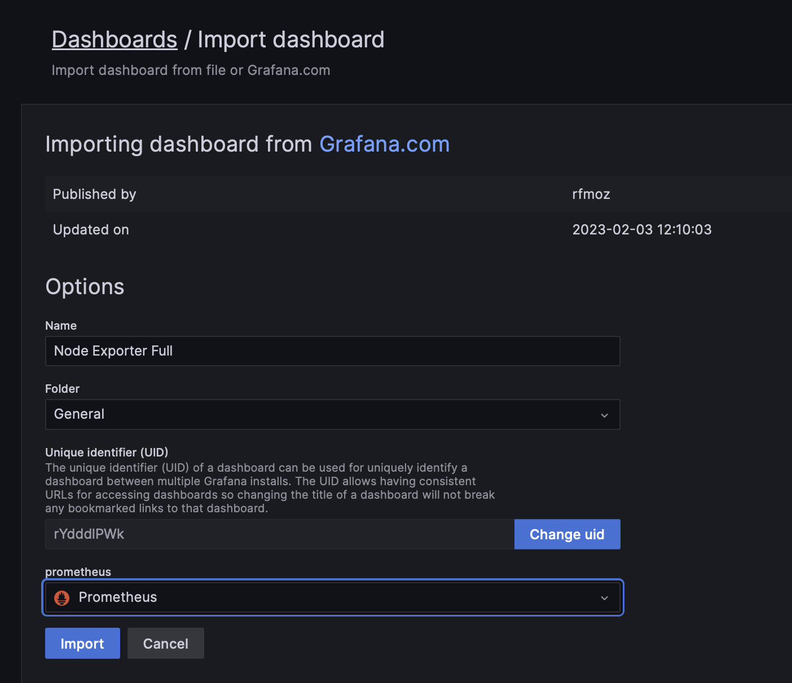
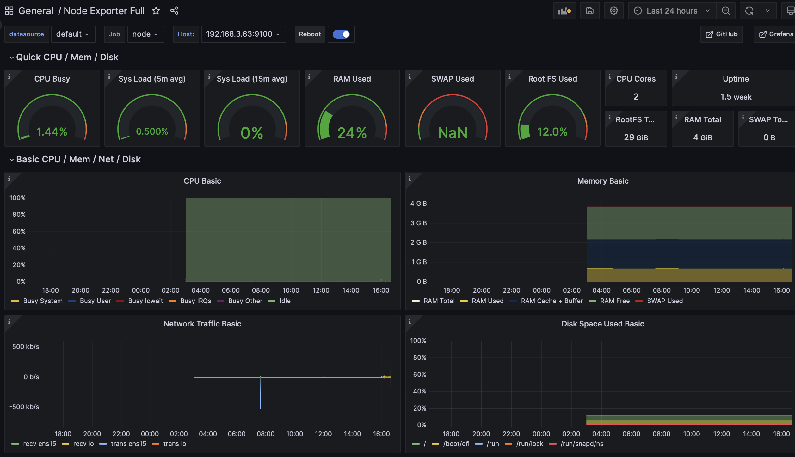
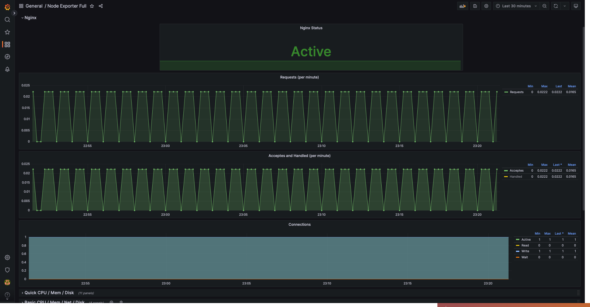
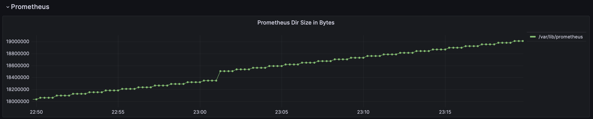

# Автоматизация развертывания и эксплуатации программного обеспечения - DevOps

[Я в Телеграм](https://t.me/amunra2) 


# Лабораторная работа №3

## Условие

[Условие лабораторной работы](./task.pdf)


## Выполнение

### 1. Установка nginx на ВМ1 и ВМ2

```bash
sudo apt install nginx
```

### 2. Установка Prometheus на ВМ1

```bash
# Прометеус
# 1. Установить Прометеус
wget https://github.com/prometheus/prometheus/releases/download/v2.43.0/prometheus-2.43.0.linux-amd64.tar.gz
tar xf prometheus-2.43.0.linux-amd64.tar.gz
cd prometheus-2.43.0.linux-amd64/
sudo cp prometheus promtool /usr/local/bin/
sudo mkdir /etc/prometheus /var/lib/prometheus
sudo cp prometheus.yml /etc/prometheus
useradd --no-create-home --home-dir / --shell /bin/false prometheus
sudo chown -R prometheus:prometheus /var/lib/prometheus

# 2. Настроить Прометеус как демона
sudo nano /etc/systemd/system/prometheus.service
`
[Unit]
Description=Prometheus
Wants=network-online.target
After=network-online.target

[Service]
User=prometheus
Group=prometheus
Restart=on-failure
ExecStart=/usr/local/bin/prometheus \
  --config.file /etc/prometheus/prometheus.yml \
  --storage.tsdb.path /var/lib/prometheus/ \
  # Установка циклической записи в 10 дней
  --storage.tsdb.retention.time=10d
ExecReload=/bin/kill -HUP $MAINPID
ProtectHome=true
ProtectSystem=full

[Install]
WantedBy=default.target
`
sudo systemctl daemon-reload
sudo systemctl start prometheus
sudo systemctl status prometheus

# 3. Кофигурациноный файл
sudo nano /etc/prometheus/prometheus.yml
`
global:
  scrape_interval:     15s
  evaluation_interval: 15s

# Alertmanager configuration
alerting:
  alertmanagers:
  - static_configs:
    - targets:
       - localhost:9093

# Node-exporter configuration
scrape_configs:
  - job_name: 'node'
    static_configs:
    - targets:
       - localhost:9100 # ip:port node-exporter ВМ1 (будет установлен позже)
       - 192.168.3.63:9100 # ip:port node-exporter ВМ2 (будет установлен позже)
`

sudo systemctl reload prometheus

# По умолчанию доступен по адресу: http://localhost:9090
```

### 3. Установка node-exporter (одинаково на ВМ1 и ВМ2)

```bash
# Node-exporter
# 1. Установить node-exporter
wget https://github.com/prometheus/node_exporter/releases/download/v1.5.0/node_exporter-1.5.0.linux-amd64.tar.gz
tar xf node_exporter-1.5.0.linux-amd64.tar.gz
cd node_exporter-1.5.0.linux-amd64/
sudo cp node_exporter /usr/local/bin
sudo useradd --no-create-home --home-dir / --shell /bin/false node_exporter

# 2. Настроить node-exporter как демона
sudo nano /etc/systemd/system/node_exporter.service
`
[Unit]
Description=Prometheus Node Exporter
After=network.target

[Service]
Type=simple
User=node_exporter
Group=node_exporter
ExecStart=/usr/local/bin/node_exporter

SyslogIdentifier=node_exporter
Restart=always

PrivateTmp=yes
ProtectHome=yes
NoNewPrivileges=yes

ProtectSystem=strict
ProtectControlGroups=true
ProtectKernelModules=true
ProtectKernelTunables=yes

[Install]
WantedBy=multi-user.target
`
sudo systemctl daemon-reload
sudo systemctl start node_exporter
sudo systemctl status node_exporter

# По умолчанию доступен по адресу: http://localhost:9000
```

### 4. Установка AlertManager на ВМ1

```bash
# Alert manager
# 1. Установка alert manager
wget https://github.com/prometheus/alertmanager/releases/download/v0.25.0/alertmanager-0.25.0.linux-amd64.tar.gz
tar xf alertmanager-*.tar.gz
cd alertmanager-0.25.0.linux-amd64/
sudo cp alertmanager /usr/local/bin
sudo mkdir /etc/alertmanager /var/lib/alertmanager
sudo cp alertmanager.yml /etc/alertmanager
sudo useradd --no-create-home --home-dir / --shell /bin/false alertmanager
sudo chown -R alertmanager:alertmanager /var/lib/alertmanager

# 2. Настроить alert manager как демона
sudo nano /etc/systemd/system/alertmanager.service
`
[Unit]
Description=Alertmanager for prometheus
After=network.target

[Service]
User=alertmanager
ExecStart=/usr/local/bin/alertmanager \
  --config.file=/etc/alertmanager/alertmanager.yml \
  --storage.path=/var/lib/alertmanager/
ExecReload=/bin/kill -HUP $MAINPID

NoNewPrivileges=true
ProtectHome=true
ProtectSystem=full

[Install]
WantedBy=multi-user.target
`
sudo systemctl daemon-reload
sudo systemctl start alertmanager
sudo systemctl status alertmanager

# По умолчанию доступен по адресу: http://localhost:9093
```

### 5. Настройка nginx ВМ1 для Prometheus и AlertManager

> В базисе через port-frowarding открыл новый порт, который прокидывается на локальный порт ВМ1, чтобы просмотреть странички Prometheus и AlertManager
> 

```bash
sudo nano /etc/nginx/nginx.conf
` # добавляется как новый сервер на своем портуу
server {
  listen 2323;
  server_name localhost;

  location / {
    proxy_pass http://localhost:9090/;
  }

  location /alert {
    rewrite  ^/alert/(.*) /$1 break;
    proxy_set_header Host $http_host;
    proxy_pass http://localhost:9093/;
  }
}
`
sudo systemctl reload nginx
```

### 6. Установка Grafana на ВМ2

```bash
# Установить Графана
wget https://dl.grafana.com/oss/release/grafana_9.4.3_amd64.deb
sudo dpkg -i grafana_9.4.3_amd64.deb
sudo systemctl enable grafana-server.service
sudo systemctl start grafana-server.service
```

### 7.  Настройка nginx ВМ2 для Grafana

> В базисе через port-frowarding открыл новый порт, который прокидывается на локальный порт ВМ2, чтобы просмотреть страничку Grafana
> 

```bash
# Настройка nginx для Графана
sudo nano /etc/nginx/nginx.conf
` # добавить новый сервер
server {
  listen 2323;
  server_name localhost;

  location / {
    rewrite  ^/grafana/(.*) /$1 break;
    proxy_set_header Host $http_host; # если ошибка origin not allowed
    proxy_pass http://localhost:3000/;
  }
}
`
sudo systemctl reload nginx
```

### 8. Добавление Prometheus в Grafana

1. На страничке Grafana перейти в Data Sources



2. Добавить новый Data Source → Prometheus





3. Ввести ip:port Prometheus на ВМ1 и внизу нажать Save&Test



4. Добавить Dashboard







5. Доступны метрики ВМ1 и ВМ2



### 9. Сбор метрик nginx с ВМ1

> На данном шаге у меня произошла ошибка с тем, что порт 9100 node-exporter был занят неким prometheus-no, поэтому я поменял стандартный порт node_exporter на 6565 (при этом в /etc/prometheus.yml тоже поменял порт для localhost)
> 
1. Обновить nginx ВМ1

```bash
# в сервер на порту 2323
location /status {
  stub_status on;
}
sudo systemctl reload nginx
```

2. Обновить service-файл node_exporter с ВМ1 (метрики будут выгружаться из созданной мною папки /var/metrics)

```bash
sudo nano /etc/systemd/system/node_exporter.service
`
ExecStart=/usr/local/bin/node_exporter \
  --collector.textfile \
  --collector.textfile.directory="/var/metrics" \
  --web.listen-address=":6565" # смена стандартного порта
`

sudo systemctl daemon-reload
sudo systemctl restart node_exporter
sudo systemctl status node_exporter
```

3. Выдать права на созданную папку

```bash
sudo chmod 777 metrics/
```

4. Создать sh-скрипт для выгрузки метрик nginx и выдать ему права на выполнение

```bash
sudo nano /usr/local/bin/nginx-metrics.sh
`
#!/bin/sh
# stub_status
STATUS_PAGE=$(curl http://localhost:2323/status)

IS_ACTIVE=$(systemctl is-active --quiet nginx.service && echo 1 || echo 0)
ACTIVE=$(echo $STATUS_PAGE | awk '{print $3}')
[ -z "$ACTIVE" ] && ACTIVE=0
ACCEPTS=$(echo $STATUS_PAGE | awk '{print $8}')
[ -z "$ACCEPTS" ] && ACCEPTS=0
HANDLED=$(echo $STATUS_PAGE | awk '{print $9}')
[ -z "$HANDLED" ] && HANDLED=0
REQUESTS=$(echo $STATUS_PAGE | awk '{print $10}')
[ -z "$REQUESTS" ] && REQUESTS=0
READING=$(echo $STATUS_PAGE | awk '{print $12}')
[ -z "$READING" ] && READING=0
WRITING=$(echo $STATUS_PAGE | awk '{print $14}')
[ -z "$WRITING" ] && WRITING=0
WAITING=$(echo $STATUS_PAGE | awk '{print $16}')
[ -z "$WAITING" ] && WAITING=0

PROM="
nginx_is_active $IS_ACTIVE\n\
nginx_active_connections $ACTIVE\n\
nginx_acceptes_connections $ACCEPTS\n\
nginx_handled_connections $HANDLED\n\
nginx_requests $REQUESTS\n\
nginx_reading_connections $READING\n\
nginx_writing_connections $WRITING\n\
nginx_waiting_connections $WAITING"

echo $PROM > /var/metrics/nginx-metrics.prom
`

sudo chmod ugo+x /usr/local/bin/nginx-metrics.sh
```

5. Запуск по крону каждую минуту

```bash
crontab -e
`
* * * * * nginx-metrics.sh
`
```

6. Настроить дашборд по своему вкусу




### 10.  Сбор метрики размера директории Prometheus

1. Скрипт для считывания размера папки и права выдать файлу

```bash
sudo nano /usr/local/bin/dir-size.sh
`
#!/bin/sh
INFO=$(du -sb "$@" | sed -ne 's/\\/\\\\/;s/"/\\"/g;s/^\([0-9]\+\)\t\(.*\)$/node_directory_size_bytes{directory="\2"} \1/p')
echo $INFO > /var/metrics/dir-size.prom
`
sudo chmod ugo+x /usr/local/bin/dir-size.sh
```

2. Запускать по крону каждую минуту

```bash
crontab -e
`
* * * * * dir-size.sh /var/lib/prometheus
`
```

3. Настроить дашборд на свой вкус




### 11. Настройка Alert Manager для Nginx

1. Получить id бота [https://t.me/MiddlemanBot](https://t.me/MiddlemanBot)


2. Настройка конфиг файла Alert Manager

```bash
sudo nano /etc/alertmanager/alertmanager.yml
`
route:
  group_by: ['alertname', 'instance', 'severity']
  group_wait: 10s
  group_interval: 10s
  repeat_interval: 1h
  receiver: 'telepush'

receivers:
  - name: 'telepush'
    webhook_configs:
    #URL с токеном после последнего слеша
    - url: 'https://telepush.dev/api/inlets/alertmanager/<ваш id бота>' 
      http_config:

inhibit_rules:
  - source_match:
      severity: 'critical'
    target_match:
      severity: 'warning'
    equal: ['alertname', 'dev', 'instance']
`
```

3. Файл с правилами

```bash
sudo nano /etc/prometheus/alert-nginx.yml
`
groups:
- name: Critical alerts
  rules:
    - alert: Nginx Down
      expr: nginx_is_active == 0
      for: 5s
      labels:
        severity: critical
      annotations:
        description: 'Nginx is down for more than 5 seconds'
`
```

4. Подредактировать конфигурационный файл Prometheus

```bash
sudo nano /etc/prometheus/prometheus.yml
` # Добавить следующие строчки
rule_files:
  - "alert-nginx.yml"
`
```

5. Перезапустить сервисы AlertManager и Prometheus (стоит также проверить статус сервисов после перезапуска)

```bash
sudo systemctl restart alertmanager.service
sudo systemctl status alertmanager.service

sudo systemctl restart prometheus.service
sudo systemctl status prometheus.service
```

6. Теперь при остановке nginx на ВМ1 спустя некотрое время в Telegram придет уведомление о том, что ngnix остановился


### Результат

1. Дашборд Grafana доступен по ссылке

```
http://<внешний ip>:<порт графаны>/d/rYdddlPWk/devops-lab03-dashboard?orgId=1&var-DS_PROMETHEUS=default&var-job=node&var-node=localhost:6565&var-diskdevices=[a-z]+|nvme[0-9]+n[0-9]+|mmcblk[0-9]+&from=now-30m&to=now
```

1. Prometheus доступен по ссылке

```
http://<внешний ip>:<порт прометеуса>/graph?g0.expr=&g0.tab=1&g0.stacked=0&g0.show_exemplars=0&g0.range_input=1h
```

1. Alert Manager доступен по ссылке

```
http://<внешний ip>:<порт прометеуса>/alert/#/alerts
```


## Ссылки

[Осваиваем мониторинг с Prometheus. Часть 1. Знакомство и установка](https://laurvas.ru/prometheus-p1/)

[Осваиваем мониторинг с Prometheus. Часть 2. PromQL и метки](https://laurvas.ru/prometheus-p2/)

[Осваиваем мониторинг с Prometheus. Часть 3. Настройка Prometheus server](https://laurvas.ru/prometheus-p3/)

[[Part 2] How to setup alertmanager and send alerts ?](https://ashish.one/blogs/setup-alertmanager/#step-1-add-settings-in-prometheusyml)

[Установка системы мониторинга Prometheus на Linux](https://www.dmosk.ru/instruktions.php?object=prometheus-linux)

[Cron Jobs — пособие для начинающих](https://tproger.ru/translations/guide-to-cron-jobs/)


_@amunra2 (2023г.)_
